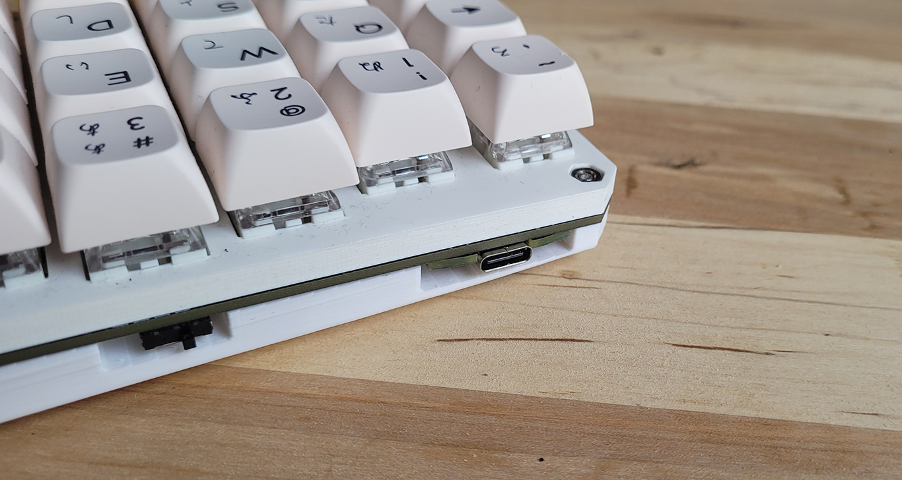
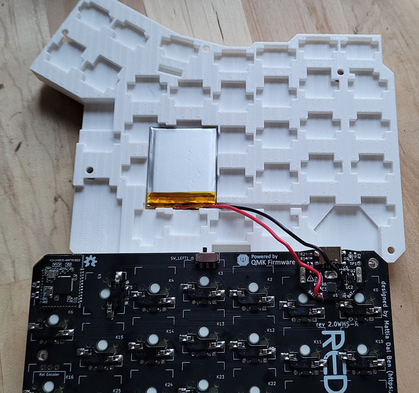

## 3D printed case

This is a modification of the [original Redox 3D printed case](https://github.com/mattdibi/redox-keyboard/tree/master/redox-w/rev2.0WHS/case) made by Mattia Dal Ben.

Changes:
 - Add cavity for a 503035 battery and to route its wire to the QUASO PCB
 - Add a ~3 degrees tilt to the case to keep the case mostly the same thickness  while having enough space for the battery
 - Hex insert for the nuts, making it much easier to assemble / disassemble

Printed in Hatchbox white PLA at 0.15 and 5% infill. I used supports for printing the screw holes on the backplate. In PrusaSlicer, I set the support style to "snug" to reduce the amount of support material on the exterior faces.

Hardware: 
 - 5x M3x8 screws
 - 5x M3 hex nuts
 - Double sided tape to hold the battery in place
 - (optional) [Rubber feet](https://www.amazon.com/dp/B06XCLYL53?psc=1&ref=ppx_yo2ov_dt_b_product_details)

