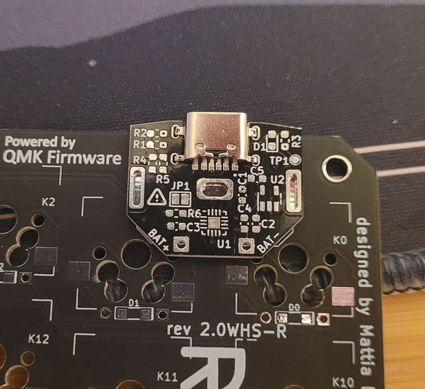

# Build Guide

> **Warning**
> When jumper `JP1` is bridged, the battery will be charged at 500mA, instead of the default 100mA. Only bridge if your battery is above 500mAh and supports quick charge at 1C, **risk of explosion**!

## Bill of materials

| Qty | Ref ID   | Item     | Digikey | LCSC *   |
|----:| :--: | -----------------------------------------------| :---------: | :--------: |
|   2 |  | QUASO PCB               |  |      |
|   2 |  | 3.7V LiPo Battery               |  |       |
|  6 | C1, C4, C5 | 1u X5R 50V Capacitor                |      [Digikey](https://www.digikey.com/en/products/detail/tdk-corporation/c1608x5r1e105k080ac/2093414) | [LCSC](https://www.lcsc.com/product-detail/Multilayer-Ceramic-Capacitors-MLCC-SMD-SMT_Samsung-Electro-Mechanics-CL10A105KB8NNNC_C15849.html) |          
|  4 | C2, C3 | 4.7u X5R 25V Capacitor                |      [Digikey](https://www.digikey.com/en/products/detail/tdk-corporation/c1608x5r1e475k080ac/3648581) | [LCSC](https://www.lcsc.com/product-detail/Multilayer-Ceramic-Capacitors-MLCC-SMD-SMT_SAMSUNG_CL10A475KO8NNNC_4-7uF-475-10-16V_C19666.html) |
|  2 | D1 | Yellow LED 0603                |      [Digikey](https://www.digikey.com/en/products/detail/liteon/LTST-C191KSKT/386839?s=N4IgTCBcDaIIwDYAMBaOAWdAONKByAIiALoC%2BQA) | [LCSC](https://www.lcsc.com/product-detail/Light-Emitting-Diodes-LED_Everlight-Elec-19-213-Y2C-CQ2R2L-3T-CY_C72038.html) |
|  2 | | USB-C power-only female connector                 |    For V1.0: **  [Digikey](https://www.digikey.com/en/products/detail/gct/usb4515-gf-a/15635471) | For V1.2: [LCSC](https://www.lcsc.com/product-detail/USB-Connectors_YIYUAN-YTC-TC6-34_C2927284.html) |
|  4 | R1, R2 | 5.1k 5% 0603 Resistor                |      [Digikey](https://www.digikey.com/en/products/detail/stackpole-electronics-inc/RMCF0603JT5K10/1757959) | [LCSC](https://www.lcsc.com/product-detail/Chip-Resistor-Surface-Mount_UNI-ROYAL-Uniroyal-Elec-0603WAF5101T5E_C23186.html) |     
|  6 | R3, R5, R6 | 10k 5% 0603 Resistor                | [Digikey](https://www.digikey.com/en/products/detail/walsin-technology-corporation/WR06X103-JTL/13239132?s=N4IgTCBcDaIIxgJxgLQHUBKAGAbADTiwGYApAFQBkBhMlAOQBEACEAXQF8g) | [LCSC](https://www.lcsc.com/product-detail/Chip-Resistor-Surface-Mount_UNI-ROYAL-Uniroyal-Elec-0603WAF1002T5E_C25804.html) | 
|  2 | R4 | 2k 5% 0603 Resistor                | [Digikey](https://www.digikey.com/en/products/detail/yageo/9c04021a2001jlhf3/342353) | [LCSC](https://www.lcsc.com/product-detail/Chip-Resistor-Surface-Mount_UNI-ROYAL-Uniroyal-Elec-0603WAF2001T5E_C22975.html) |
|  2 | U1 | LiPo Battery Manager BQ24075RGTR    |      [Digikey](https://www.digikey.com/en/products/detail/texas-instruments/BQ24075RGTR/2047273?s=N4IgTCBcDa4JwDYC0BmAHGg7AFiQRiQDkAREAXQF8g) | [LCSC](https://www.lcsc.com/product-detail/Battery-Management-ICs_Texas-Instruments-BQ24075TRGTR_C544783.html) |
|  2 | U2 | LDO 3V regulator TPS7A0330   | [Digikey](https://www.digikey.com/en/products/detail/texas-instruments/TPS7A0330PDBVR/12165132) | [LCSC](https://www.lcsc.com/product-detail/Linear-Voltage-Regulators-LDO_Texas-Instruments-TPS7A0330PDBVR_C3752328.html) |

*I haven't tried ordering the LCSC parts, they should work.

**Please note, that version 1.0 of the board uses [USB4515](https://www.digikey.com/en/products/detail/gct/usb4515-gf-a/15635471), while version 1.2 uses [YTC-TC6-34](https://www.lcsc.com/product-detail/USB-Connectors_YIYUAN-YTC-TC6-34_C2927284.html) as the USB-C connector. From checking the datasheet, it seems that USB4515 would fit on version 1.2 of the board, but I haven't tested it. 

### Battery Selection

Any 3.7V LiPo single cell battery should work with QUASO. Nano!Nice suggests using a 301230 battery (~100mAh) for a low power keyboard like the wireless Redox. For reference, a CR2032 coin battery as a capacity of around 225mAh. I used a [503035 500mAh battery](https://www.digikey.com/en/products/detail/adafruit-industries-llc/1578/5054539?s=N4IgTCBcDaIIwFYwA4C0dkBY6oHIBEACEAXQF8g) for my build. You can [find here](3d_printed_case/), a 3D printed case that fits the dimensions of the 503035. If you use a different battery, you'll need a different case.

## Instructions
The PCB is easy to solder by hand, except for the battery management chip (BQ24075). Because of the BQ24075, I **strongly recommend** you use a PCB assembly service to solder this PCB or use a stencil + solder paste. Beware that I have **NOT tested** the gerber files / BOM / CPT for assembly!

### Assembling by Hand the QUASO PCB
The first component to solder is BQ24075 (U1). I followed [this video](https://www.youtube.com/watch?v=X3Rc1s6EpSI) to solder the BQ24075 using a heat gun and a temperature probe:
1. Put flux and thin the pads. Put as little solder on the center pad as possible.
2. Clean up and reapply flux.
3. Place the BQ24075 on the PCB. Check that the dot on the chip is aligned like this:

1. (Soak) Slowly heat the PCB using the heat gun over the course of 1-2min, until the PCB reaches a temperature of 150C.
2. (Reflow) Heat the PCB to 217C and hold it there for 30s. You should see the solder melting. The temperature and timing will depend on the type of solder you use.
3. (Cool) Slowly reduce the temperature back to 150C over the course of 1min by pulling back the heatgun. Then remove the heat gun and let it cool down.
4. Make sure that the chip is aligned with the pads. Check for shorts.

The other components are pretty straight forward to solder and can be done in any order. I soldered U2 first, then all the capacitors, the diode and resistors, and finally I soldered the USB connector.

Make sure that diode D1 is oriented correctly, by looking at the pad under the diode:

#### Testing
You can test that the USB port and 3V regulator is working correctly without the battery.
 - Plug the USB-C port and check the voltages you should see: 
   - 5V between test point TP1 and the ground
   - 3V between the holes on either side of the board and the ground. 

### Connecting the Battery
1. Cut the battery wires to length. If you're using a 503035 battery and my 3D printed case, leave at least 65mm of wire. 
2. Solder the battery's wires to BAT+ and BAT-. If you orient the wires towards the USB connector, it'll be slightly easier to close the case. 

If you're building the right hand Redox, make the battery wire go towards the right. If you're building the left hand Redox, do the opposite.

#### Testing
 - Check that when the USB is plugged in, the LED lights up.
 - Check that when the USB is not plugged in, the battery is providing power:
   - the voltage between BAT+ and ground should be the same as between test point TP1 and the ground;
   - And you should also see 3V between the holes on either side of the board and the ground;
 - Check that battery charging works: have the battery discharged to a voltage of less than 4.1V. Plug in the USB and check after half an hour if the voltage has increased.

### Soldering QUASO to Redox
1. Unsolder the coin cell holder from the Redox keyboard. Make sure to not use too much force when removing the holder.
2. Remove excess solder using a soldering wick.
3. Align the three holes on the QUASO to the pad on the Redox. Version 1.0 of the Quaso PCB doesn't sit flush with the border of the Redox PCB.

4. Once you're satisfied with the alignment, solder it to the PCB starting with the two 3V output holes. They don't have a ground plane, so they're much easier to solder first.
5. Solder the center ground hole.

#### Testing
 - Test that you're getting 3V on the pin of the power switch.
 - Test that when the switch is ON, you still get 3V

#### Finished assembly

Hopefully you did a better soldering job than me...

### Fitting in the Case
This assumes you're using the 3D printed case:
1. Put double sided tape on the battery.
2. Insert the battery in its receptacle in the bottom case.

3. Pass the battery's wires in their trench.
4. Close the bottom case while making sure that the wires are not pinched by the case.
5. Screw the bottom case.

## Troubleshooting
##### USB works, but when powered by only the battery, no power is output by BQ24075
I had this issue on both of my PCB. Some of the pins on the BQ24075 were not properly connected. I solved it by using a soldering iron to solder the four sides of the BQ24075. In my case, the main culprit  was pin 15 (this pin disables/enables the battery output), since it's directly connected to ground, it takes more heat to properly solder it.