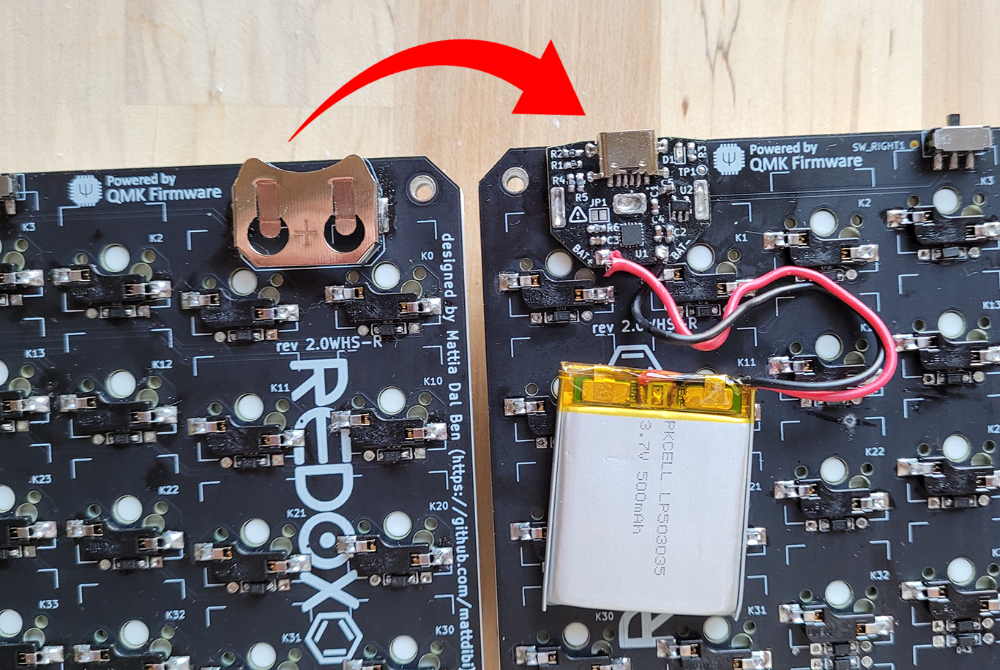
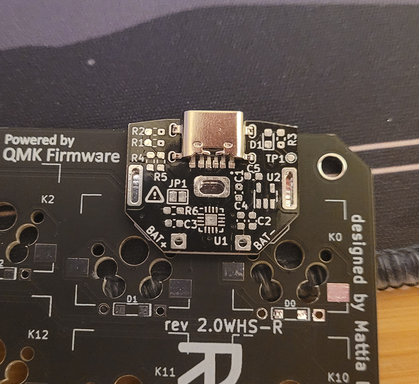
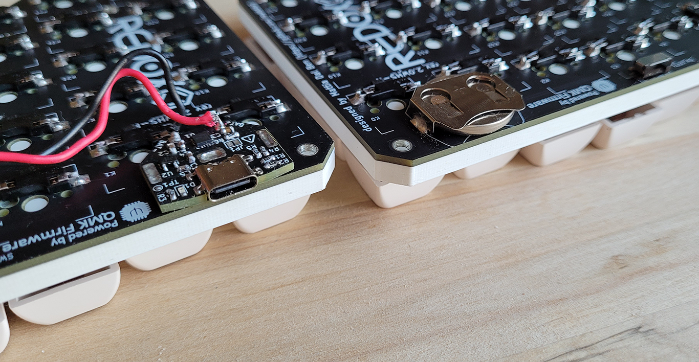
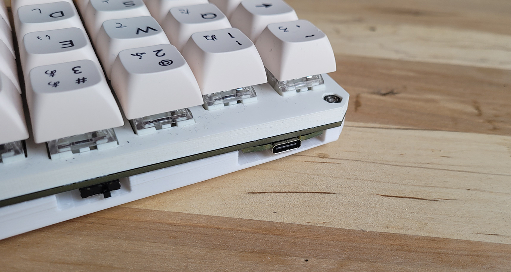
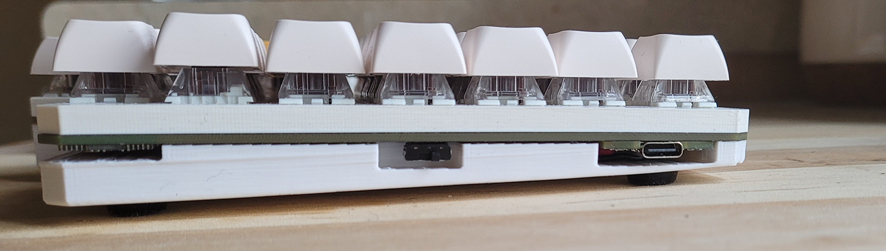
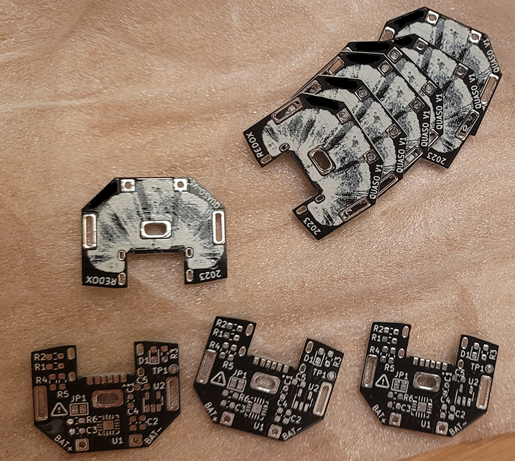
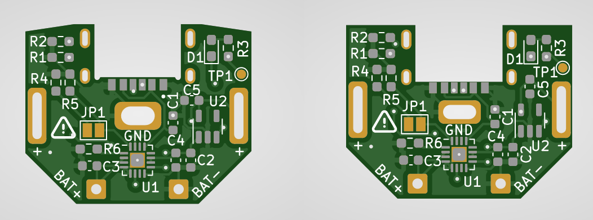

# QUASO: A Rechargeable LiPo Adapter for Redox

Project **QUASO**: **Q**uick **U**sb **A**dapter for the wireles**S** red**O**x. This PCB replaces the coin cell battery of a [wireless Redox keyboard](https://github.com/mattdibi/redox-keyboard), it has a USB-C connector and circuitry to charge a LiPo battery. Gone are the days of buying disposable coin cell batteries for your wireless keyboard.

## Rationale

I really like my wireless Redox, however, I find that having to replace the coin cell battery is kind of annoying and wasteful. I could have just built a non-wireless Redox and changed the pro-micro to a Nice!Nano to get both wireless + rechargeable LiPo. But that would have been a waste, since it means building a brand new keyboard just to save on a few coin cells. Hence why I decided to design this mod.

## Build instructions

See [BUILD.md](BUILD.md) for the build and assembly instructions.

You can [find here](3d_printed_case/) a 3D printed case that accommodates a 503035 LiPo battery.

## Limitations

The USB-C connector is only used to charge the battery, it doesn't transmit data.

Because the PCB replaces the coin cell battery holder, the keyboard's on/off switch doesn't disconnect the LiPo battery from the battery management circuit. This means that when the switch is turned OFF, the battery will still consume a tiny bit of power, because it's powering the battery management chip and the voltage regulator. It also means that the battery can be recharged while the keyboard is turned off.

## Pictures

## Change Log

- V1.0: Initial version [tested]
- V1.2: [Not tested]
   - Change regulated voltage from 3.3V to 3V, the regulator will only cut off when the battery voltage reach 3.2V, instead of 3.5V.  
   - Change the USB connector for a part available on LCSL.
   - Swap of components to make JLCPCB assembly using  less extended components.
   - Make the top of the PCB flush with the keyboard's PCB.

